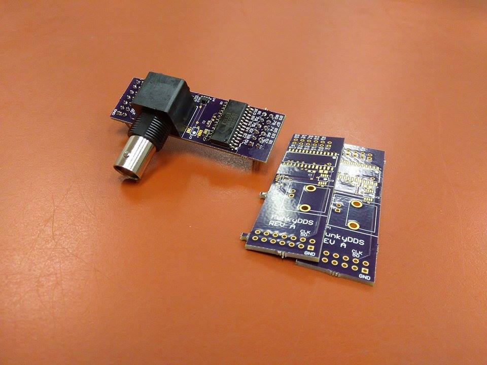

# Board-Portfolio
Pictures of some printed circuit boards I've designed

<figcaption>A PIC microcontroller-based synthesizer board</figcaption>

<figcaption>
  A daugterboard for the Mojo FPGA development board which uses a TI DAC chip to perform direct digital synthesis (DDS)
</figcaption>

<figcaption>
  Layout of a PCB in Altium Designer
</figcaption>

<figcaption>
  3D model of a CNC control board 
</figcaption>

